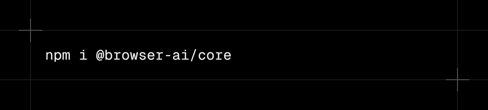

# Browser AI provider for Vercel AI SDK

<div align="center">

</div>

<div align="center">

[](https://www.npmjs.com/package/@browser-ai/core)
[](https://www.npmjs.com/package/@browser-ai/core)

</div>

A TypeScript library that provides access to browser-based AI capabilities with seamless fallback to using server-side models using the [Vercel AI SDK](https://ai-sdk.dev/). This library enables you to leverage **Chrome** and **Edge's** built-in browser AI features ([Prompt API](https://github.com/webmachinelearning/prompt-api)) with the AI SDK.

## Installation

```bash
npm i @browser-ai/core
```

The `@browser-ai/core` package is the AI SDK provider for your Chrome and Edge browser's built-in browser AI models. It provides seamless access to both language models and text embeddings through browser-native APIs.

## Documentation

For a complete documentation including examples, refer to [this](https://www.browser-ai.dev/docs/ai-sdk-v6/core) site.

## Author

2025 © Jakob Hoeg Mørk
