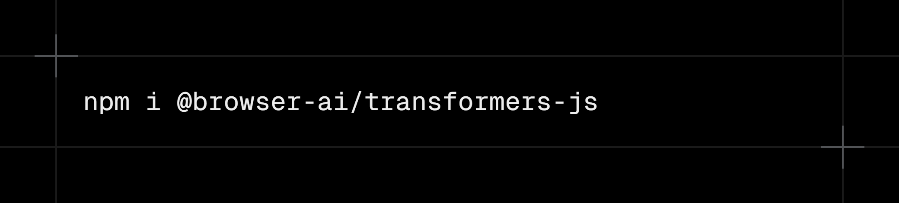

# Transformers.js provider for Vercel AI SDK

<div align="center">

</div>

<div align="center">

[](https://www.npmjs.com/package/@browser-ai/transformers-js)
[](https://www.npmjs.com/package/@browser-ai/transformers-js)

</div>

[Transformers.js](https://github.com/xenova/transformers.js) provider for the [Vercel AI SDK](https://ai-sdk.dev/). Run popular open-source 🤗 Transformers models directly in the browser OR even server-side.

## Installation

```bash
npm i @browser-ai/transformers-js
```

The `@browser-ai/transformers-js` package is the AI SDK provider for Transformers models powered by the official `@huggingface/transformers` library. It supports both client-side (browser) and server-side (Node.js) inference.

## Documentation

For a complete documentation including examples, refer to [this](https://www.browser-ai.dev/docs/ai-sdk-v6/transformers-js) site.

## Author

2025 © Jakob Hoeg Mørk

## Credits

The Hugging Face, Transformers.js, and Vercel AI SDK teams
