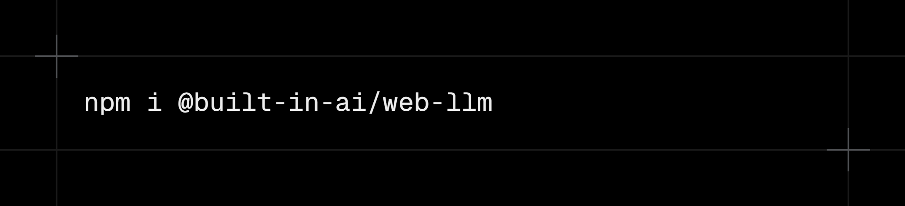

# WebLLM provider for Vercel AI SDK

<div align="center">

</div>

<div align="center">

<!-- [](https://www.npmjs.com/package/@built-in-ai/web-llm)
[](https://www.npmjs.com/package/@built-in-ai/web-llm) -->

</div>

[WebLLM](https://github.com/mlc-ai/web-llm) model provider for [Vercel AI SDK](https://ai-sdk.dev/). This library enables you to use the AI SDK with popular open-source models running directly in your web browser.

## Installation

> [!NOTE]
> This only works with the new v5 of the Vercel AI SDK.

```bash
npm i @built-in-ai/web-llm
```

The `@built-in-ai/web-llm` package is the AI SDK provider for open-source built-in AI models leveraging the [WebLLM](https://github.com/mlc-ai/web-llm) inference engine.

## Browser Requirements

A WebGPU-compatible browser is needed to run these models. Check out the [API](https://developer.mozilla.org/en-US/docs/Web/API/WebGPU_API) for more information.

## Usage

### Basic Usage

```typescript
import { streamText } from "ai";
import { webLLM } from "@built-in-ai/web-llm";

const result = streamText({ // or generateText
  model: webLLM('Llama-3.2-3B-Instruct-q4f16_1-MLC'),
  messages: [{ role: "user", content: "Hello, how are you?" }],
});

for await (const chunk of result.textStream) {
  console.log(chunk);
}
```

### Advanced Usage

If you're already familiar with the WebLLM engine library (or in general inference with models in the browser), you'll know that to make it run effeciently, you probably know that you need to use [web workers](https://developer.mozilla.org/en-US/docs/Web/API/Web_Workers_API) to offload the heavy model computation to a different thread than the UI. You can check out WebLLM's official [docs](https://webllm.mlc.ai/docs/user/advanced_usage.html) for more information.

1. Create your `worker.ts` file:

```typescript
import { WebWorkerMLCEngineHandler } from "@built-in-ai/web-llm";

const handler = new WebWorkerMLCEngineHandler();
self.onmessage = (msg: MessageEvent) => {
  handler.onmessage(msg);
};
```

2. Provide it in the model instance:

```typescript
import { streamText } from "ai";
import { webLLM } from "@built-in-ai/web-llm";

const result = streamText({ // or generateText
  model: webLLM('Qwen3-0.6B-q0f16-MLC', {
    worker: new Worker(new URL("./worker.ts", import.meta.url), {
      type: "module",
    }),
  });,
  messages: [{ role: "user", content: "Hello, how are you?" }],
});

for await (const chunk of result.textStream) {
  console.log(chunk);
}
```

## Download Progress Tracking

When using the open-source models for the first time, the model needs to be downloaded before use.

You'll probably want to show download progress in your applications to improve UX.

### Basic Progress Monitoring

```typescript
import { streamText } from "ai";
import { webLLM } from "@built-in-ai/web-llm";

const model = webLLM('Llama-3.2-3B-Instruct-q4f16_1-MLC'),
const availability = await model.availability();

if (availability === "unavailable") {
  console.log("Browser doesn't support built-in AI models");
  return;
}

if (availability === "downloadable") {
  await model.createSessionWithProgress((progress) => {
    console.log(`Download progress: ${Math.round(progress * 100)}%`);
  });
}

// Model is ready
const result = streamText({
  model,
  messages: [{ role: "user", content: "Hello!" }],
});
```

## Integration with useChat Hook

When using this library with the `useChat` hook, you'll need to create a [custom transport](https://v5.ai-sdk.dev/docs/ai-sdk-ui/transport#transport) implementation to handle client-side AI with download progress. 

You can do this by importing `WebLLMUIMessage` from `@built-in-ai/core` that extends `UIMessage` to include [data parts](https://v5.ai-sdk.dev/docs/ai-sdk-ui/streaming-data) such as download progress.

<!-- See the complete working example: **[`/examples/next-hybrid/util/client-side-chat-transport.ts`](../../examples/next-hybrid/util/client-side-chat-transport.ts)** and the **[`/examples/next-hybrid/app/page.tsx`](../../examples/next-hybrid/app/page.tsx)** components. -->

This example includes:

- Download progress with UI progress bar and status message updates
- Hybrid client/server architecture with fallback
- Error handling and notifications
- Full integration with `useChat` hook

## Why?

The AI SDK provides a ton of quality of life improvements for developers creating AI applications. If you've ever tried building an app that utilizes local language models, you're probably familiar with the painpoints of doing so.

This library is supposed to help close the gap between how we use regular AI models and local models. Essentially making it easy for developers to test and integrate smaller models into their applications without having to think too much about the intricasies.